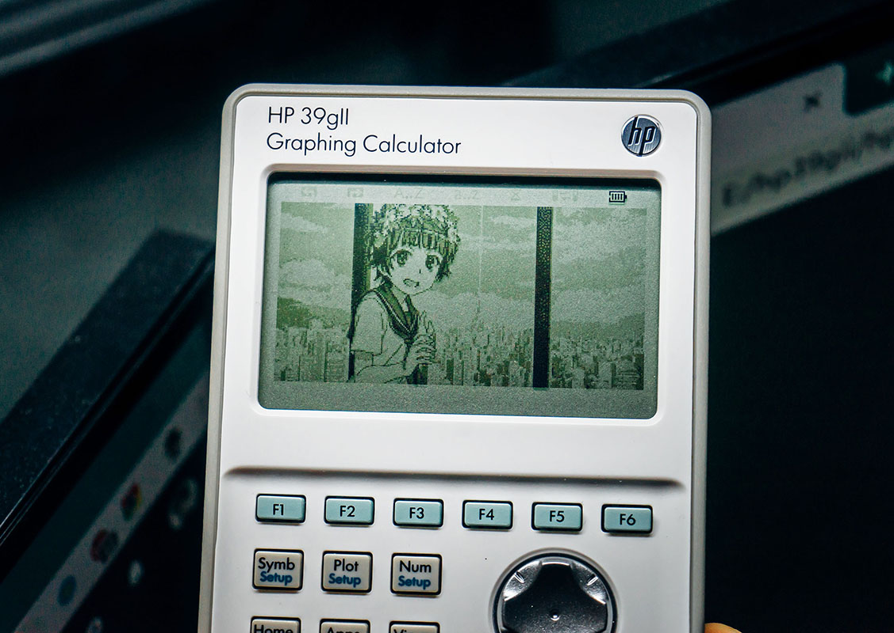

# HP-39GII DIMGROB
## 使用方法
打开index.html并选取图片文件，将生成的数据通过HP-39GII Connectivity Kit保存到机身的L变量中（L1, L2, etc）。  
绘制函数：
```
EXPORT RECALLLIST(LST,OX,OY)
BEGIN
  LOCAL W,H,R,X,Y,T,C,P;
  LST(1)►W;
  LST(2)►H;
  INT(W/16)►R;
  IF W MOD 16>0 THEN
    R+1►R
  END; 
  FOR Y FROM 0 TO H-1 DO
    FOR T FROM 0 TO R-1 DO 
      LST(Y*R+T+3)►P;
      FOR X FROM 0 TO 15 DO
        IF X+16*T≥W THEN
          BREAK;
        END;
        P MOD 4►C;
        INT(P/4)►P;
        PIXON_P((15-X)+16*T+OX,Y+OY,C);
      END;
    END;
  END;
  FREEZE
END;
```
使用例：
```
EXPORT RECALLALL()
BEGIN
  RECT();
  RECALLLIST(L2,0,0);
  RECALLLIST(L3,0,50);
  RECALLLIST(L4,0,100);
  FREEZE;
END;
```
因列表只能保存999个数据，所以将256x127的图片拆为3个LIST。可以通过SUBGROB将绘制的图片保存到G变量（G1, G2, etc）
## 预览
